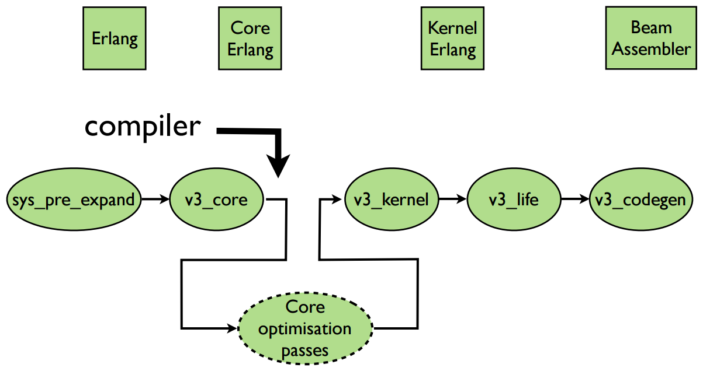

# Compiler

## Internals

Another part of that project is a *Compiler*. It uses all standard techniques built in the *Erlang VM* related with compiler pipeline in order to fully leverage machine abilities. It is a **toy**, and it does not do any additional optimizations (like trimming the unused functions, rolling up increments and decrements etc.).

### Compiler pipeline

[*Image taken from the excellent presentation.*](http://www.erlang-factory.com/upload/presentations/523/EFSF2012-Implementinglanguages.pdf)

Life of an *Erlang* file (http://studzien.github.io/hack-vm/part1.html#slide-5) begins with *preprocessing* (in order to evaluate all macros). Then, we are doing an *expansion* process , which is the first level of indirection on which you can hook as a *compiler engineer*.

If we want to *hook* into compiler pipeline we can do it on various levels. First possible way to hook, is to generate the *Erlang Abstract Format* parse trees, described [here](http://www.erlang.org/doc/apps/erts/absform.html). It is a very convenient way to create new language, and - what is even more important - you can still use tools like *dialyzer* or *cover*, because they are operating on that level (https://twitter.com/josevalim/status/626471306825986049). Below that level you are loosing the ability of running them on your code, and translating results into your representation.

Second place where you can hook (and at this level this compiler is implemented) is compilation to the *Core Erlang*. There is no point of running those tools on the *Brainfuck* / *Brainfork* code, so it is a small loss. :wink: AFAIR this level is used also by a *LFE* compiler and *codegen* module. The main drawback is that, even if there is a specification of the format and complete documentation of the `cerl` module (which is a helper module for generating *Core Erlang* forms) there are not so many examples how they should look like.

You can also compile to *Kernel Erlang* or even directly to the *BEAM Assembler*, but they have even more scarce resources and documentation. I guess that you have to *use the code*, to properly attack this level of compiler.

### Lexer

Before we can generate our forms in the *Core Erlang* format, we need to proceed with standard procedures related to any kind of languages. If the syntax and semantics are simple, like in our case (it is just a *Turing machine*-like syntax and semantics), correspondingly *lexer* and *parser* will be really simple.

In both cases *Erlang VM* has built-in mechanisms for dealing with those problems. File with the extension `.xrl` is a Lexer definition. It is called a [*Leex*](http://erlang.org/doc/man/leex.html), a lexical analyzer generator for *Erlang*. Taking the name as an example, you will probably deduce that it is heavily inspired by a predecessors called *Lex* or *Flex* - and that is true, syntax and behavior are identical. Lexer example can be shown [here](../src/bferl_compiler_lexer_bf.xrl).

### Parser

The same applies to parser. All files with an extension `.yrl` are handled by [*Yecc*](http://erlang.org/doc/man/yecc.html) which is an *LALR-1* parser generator for Erlang. Again it is inspired by *Yacc*. Parser example can be shown [here](../src/bferl_compiler_parser_bf.yrl). As you can see there, the only one rule which should be verified is related with loops and their syntactical structure (open and not closed loops are invalid *Brainfuck* / *Brainfork* programs).

### Code generation

This implementation generates the *Core Erlang* forms and then proceeds with a standard compilation flow down to the *BEAM* representation. Afterwards, it can be loaded inside a *VM* as a normal module. Whole implementation is gathered in the [bferl_compiler_codegen](../src/bferl_compiler_codegen.erl).

There is a one *thing*, which not explained enough in various places. Because we are compiling directly to *Core Erlang*, compiler cannot add two functions which are required by a *VM* in order to load modules properly - I am talking about `module_info/{0,1}`. The simplest possible implementation is a call to the `erlang:get_module_info/{0,1}` depending on the function version. Afterwards, we can construct and generate code in our module as we like.

#### What exactly is a *Core Erlang*?

*Core Erlang* is an intermediate representation of Erlang, intended to lie at a level between source code and the intermediate code typically found in compilers. Specification can be found [here](https://www.it.uu.se/research/group/hipe/cerl/doc/core_erlang-1.0.3.pdf).

The main point of choosing that over the generating the *Erlang* syntax is its regularity - it is just easier to generate *Core Erlang*, because it has much stricter and fair rules regarding, both semantics and structure. Additionally, all forms and clauses have helpers prepared in the modules [`cerl`](http://erldocs.com/18.0/compiler/cerl.html) and [`cerl_clauses`](http://erldocs.com/18.0/compiler/cerl_clauses.html).

### Modules

#### `bferl_tools_compiler`

Main compiler *front-end*, implemented as a `gen_server`. It exposes couple of methods, stores state of the compiler (in order to properly build the module name). Also has some simple debugging facilities.

After compiling and loading a module it will return the name of it as a result. Generated module has two entry points available from the outside:

- `ModuleName:start/0` - It starts the compiled program. It will use *console* as a main I/O mechanism.
- `ModuleName:start/1` - It starts the compiled program, but it will provide an input tape as an input mechanism. Still, *console* is used as an output mechanism.

For now `ModuleName` is constructed in a very simple way - it is an atom with in form `evaluation_N`, where `N` is a number of performed compilations in that particular server instance. Keep in mind that the results will differ from your expectations, when you have multiple instances of that server or your server restarted, but the node did not, and it still has some compiled modules loaded.

#### `bferl_compiler_lexer_*` and `bferl_compiler_parser_*`

Lexer and parser generated from files `.xrl` (lexer) and `.yrl` (parser) via mechanisms described above. **It is a generated code, there will be dragons there**.

#### `bferl_compiler_codegen`

Actually the main responsibility of the compiler, besides lexical analysis and verifying its semantics via parser, it has to generate actual code, which will be compiled afterwards. In this implementation *code generation* module is a crucial part of the compiler, mostly because of really scarce syntactical and semantic rules.

It uses heavily `cerl` module, and it is build with many smaller abstractions, but code is hard to read at first, because of different nature of the *Core Erlang*. Probably the safest place to start will be a `make_module/4` function (at the bottom of a file).

## API

### Helpers

Application level helpers and shortcuts for ease of use.

- `bferl_app:compile_file/1`
  - It compiles a file from a provided path name.
  - It can differentiate *Brainfuck* from *Brainfork* by an extension (details [here](#brainfork)).
- `bferl_app:compile_file/2`
  - It compiles a file in `debug` mode from a provided path name.
  - **Only** a `debug` atom is acceptable as a second argument.
  - It can differentiate *Brainfuck* from *Brainfork* by an extension (details [here](#brainfork)).
- `bferl_app:compile_code/1`
  - It compiles a code provided as a string in first argument.
  - Code is always interpreted as *Brainfuck
- `bferl_app:compile_code/2`
  - It compiles code in `debug` mode, provided as a string in first argument.
  - **Only** a `debug` atom is acceptable as a second argument.
  - Code is always interpreted as *Brainfuck

All of those functions returns either:

- `{ok, ModuleName}` - where `ModuleName` is a new module name with entry points described above.
- `{error, ErrorsList, WarningsList, Metadata}`

### `bferl_tools_compiler`

- `bferl_tools_compiler:start_link/0`
  - It starts the server, as usually `start_link` do.
- `bferl_tools_compiler:compile_and_load/2`
  - It compiles and loads a module from a provided program (first argument) and its type (either `"Brainfuck"` or `"Brainfork"`).
  - Functions returns either
    - `{ok, ModuleName}` - where `ModuleName` is a new module name with entry points described above.
    - `{error, ErrorsList, WarningsList, Metadata}`
- `bferl_tools_compiler:compile_and_load/3`
  - Does the same thing as above but also delivers the flags to the compilation process (third argument).
  - Acceptable flags:
    - `debug` - Inserts the debug instructions to the generated code (they print state after executing each instruction).
    - `pretty_print` - It pretty prints the generated *Core Erlang* representation. **CAUTION**: it can be really huge.
  - Functions returns either
    - `{ok, ModuleName}` - where `ModuleName` is a new module name with entry points described above.
    - `{error, ErrorsList, WarningsList, Metadata}`

### *Brainfork*

If you want to compile a *Brainfork* code, you have to use application helpers for that, which are reading the files. It is the only way to properly deliver a *Brainfork* code to the compiler subsystem. It will recognize this language by the extension - each file with `.bfo` extension will be treated as a *Brainfork* code.

## Example Session

*TODO*
